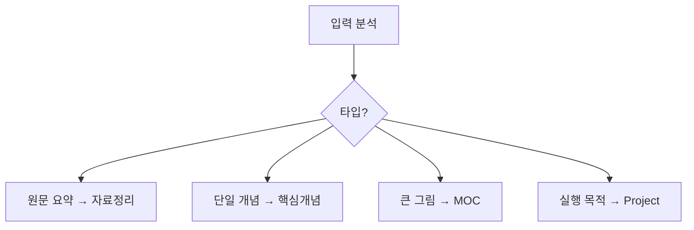

# 생성 시나리오 Spec (핵심개념)

## 트리거 키워드
- "노트 만들어줘", "개념 정리해줘"
- "핵심개념 생성", "permanent note"

## 노트 타입 결정


## 핵심개념 생성 규칙

### 1. 템플릿 사용
```
Filesystem:read_file("/90-설정/템플릿-Permanent.md")
```

### 2. 필수 YAML 필드
```yaml
---
type: permanent
source: [[정리-YYYYMMDD-주제]]  # ✅ 필수
created: YYYY-MM-DD
tags: [permanent/topic]
---
```

### 3. 저장 규칙
- 경로: `/20-정리/핵심개념/`
- 파일명: `개념-YYYYMMDDa-이름.md`
- 100줄 제한 ✅ 필수

### 4. 링크 필수 규칙
| 링크 타입 | 요구사항 | 레벨 |
|----------|----------|------|
| source | 자료정리 또는 원문 | ✅ 필수 |
| MOC 연결 | 최소 1개 이상 | ✅ 필수 |
| 개념 연결 | 2개 이상 권장 | 🔶 권장 |

### 5. MOC 등록 프로세스
```python
1. 관련 MOC 검색 (태그 기반)
2. if MOC 존재:
   - "[[맵-주제]]에 등록하시겠습니까?"
3. else:
   - "새 MOC를 생성하시겠습니까?"
4. 양방향 링크 추가
```

### 6. 개념 연결 프로세스
```python
1. 유사 개념 검색 (태그/키워드)
2. if 관련개념 >= 2:
   - 관계 명시하여 링크 제안
3. else:
   - "관련 개념 부족" 경고
```

## 링크 품질 가이드
```markdown
❌ Bad: - [[개념A]]
✅ Good: - [[개념A]]는 이 개념의 구체적 예시
```

## 검증 체크리스트
- [ ] source 필드 존재
- [ ] source 파일 실제 존재  
- [ ] MOC 1개 이상 연결
- [ ] 100줄 미만
- [ ] 단일 개념만 다룸
- [ ] 파일명 규칙 준수