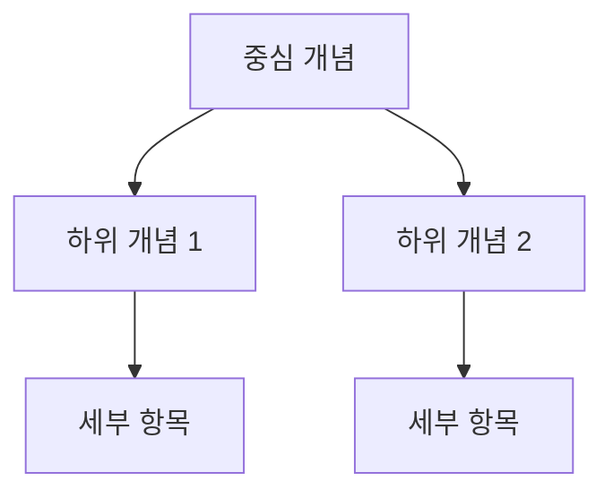

# {{title}} MOC

## 📌 개요

<!-- 이 주제의 전체적인 큰 그림 -->
<!-- 왜 이 주제가 중요한가? -->

---

## 🗺️ 주제 지도

### 핵심 개념
- [[핵심 개념 1]]
- [[핵심 개념 2]]
- [[핵심 개념 3]]

### 관련 기술
- [[기술 A]]
- [[기술 B]]

### 응용 분야
- [[응용 분야 1]]
- [[응용 분야 2]]

---

## 📚 학습 경로

### 🔰 초급
1. [[기초 개념 A]]
2. [[기초 개념 B]]

**목표**: 

### 🎓 중급
1. [[심화 개념 A]]
2. [[심화 개념 B]]

**목표**: 

### 🚀 고급
1. [[전문 개념 A]]
2. [[전문 개념 B]]

**목표**: 

---

## 📖 주요 문헌

### 필수 문헌
- [[Literature Note 1]]
- [[Literature Note 2]]

### 추천 문헌
- [[Literature Note 3]]
- [[Literature Note 4]]

---

## 🔗 관련 주제

- [[관련 MOC A]]
- [[관련 MOC B]]

---

## 🎯 프로젝트

- [[Project 1]] - [간단한 설명]
- [[Project 2]] - [간단한 설명]

---

## 🔍 Dataview 쿼리

### 모든 관련 노트
```dataview
TABLE type, created, tags
FROM #관련태그
SORT created DESC
```

### Permanent Notes만
```dataview
LIST
FROM #permanent AND #관련태그
SORT title ASC
```

---

## 🌐 시각화



---

## 💡 핵심 인사이트

<!-- 이 주제에서 발견한 핵심 통찰 -->

---

## 🔄 최근 업데이트

- {{date:YYYY-MM-DD}}: MOC 생성

---

## 🎓 다음 학습 주제

- [ ] 
- [ ] 

---

**생성일**: {{date:YYYY-MM-DD}}  
**최종 수정**: {{date:YYYY-MM-DD}}  
**상태**: 초안|진행중|완성
